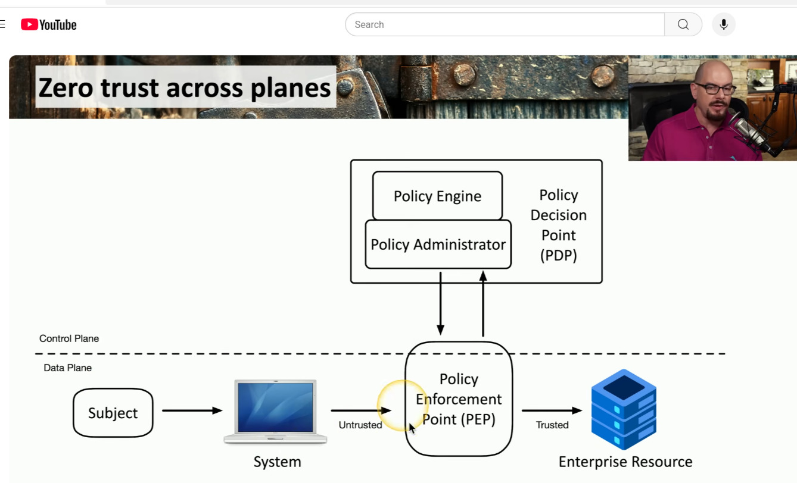

Section 1.1

Ways to protect digital software:

-Firewalls
-Anti-Virus

    Further Control

            Mangerial Controls:
                -Admin controls
                -Security Policies
                -Standard Operating Procedures 

            Human Security:
                -Security Guards
                -Awareness programs 

            Physical Security:
                -Limit physical access
                -Guard Posts
                -Fences 
                -Badges
        

Whats the purpose?
    Preventing the access of critical systems and data.

Different ways to protect an organization.

-----------------------------------------------

Section 1.2

CIA Triad

Confidentiality 
Integrity 
Availability 

Ways to secure Confidentiality:
-Encryption 
-Access Controls 
-Two Factor Authetntication 

Ways to secure Integrity:
-Data properly secured and transferred 
-Hashing 
-Digital Signatures 
-Certificates
-Non-repudation 

Ways to secure Availability:
-Redundancy 
-Fault Tolerance 
-Patching 

NON REPUDATION:

Proof of Integrity:
    -"Like a contract" (confirms that you signed it and this is what you agreed to, its not fake shit)
        Cyber equivalent:
            -Hash (Expand on what hashing is) (Doesn't confirm "who" just whether data has been changed)

Proof of Origin: 

    Private and Public keys:
        -A hash is created of the file then encrypted (Public key (Using well known encryption method)) then sent to the other user 
        -The file is then decrypted by the other user using a private key
        -Once deencrypted the hash is seen and compared to verify the intergrity of the file 
        -The data can also be read

        

AAA = Authentication Authorization Accounting 

Authentication = Password or Certificate 
Authorization = Level of Access 
Accounting = Record Keeping

CA = Certificate Authority 
(Manages the certificates)

CA compares its certifcate to devices certificate to confirm whether it has autheticated 

Authorization Model = Users get assigned a group role that has general perms

Gap Analysis = How to prepare security for the future (Takes long time)

Zero Trust = Paranoid approach to security everytime you gain access you must authenticate 

Planes:
Physical
Virtual
Cloud

Data plane = Routers and switches (Low level programming)
Control Plane = Direction and flow (High level programming)

Adaptive Identity 
Using diff factors and adapting the security based on whats needed (IP, Physical location, relationship to company)

Threat scope reduction
Limit entry points for hackers

Policy driven access controls
Adaptive and predefined rules working together 

Security zones
More control on where you are connecting from and placing rules

Subjects & Systems = End users, applications and non human entities

Policy Enforcement Point = The bar bouncer for traffic 
    -Can deny or allow entry

Policy decision point = Bunch of dudes who decide on whether this dude is chill and allow him into the club or nah 

Policy engine = Criteria for whehther this dude has enough swag and aura 

Policy admin point = This dude relays to the bouncer who to kick out and who to let in 

Access control vestibules = Basicially how doors get locked easy to deduce

Sensors:
Infrared
Ultrasonic
Microwave
Pressure

Honeypots = Here dog, here's a treat then get caged

Honeyfiles = Shiny file 

Honeytoken = Number on the file to identify missing number therefore missing honey file :)

----------------------------------------------------------------------------------------------------------------------

Section 1.3 

Change management = Paranoid way to maintain control 

Change Approval process (Depending on practice exam may need to refresh on specifics)

Ownership = Dude in charge of the department dont make changes hands off to his IT or minions to take care of it 

Stakeholders = Noisy business men who wants the in's and out how its effecting their profits and company 

Impact Analysis = how much impact it will ahve 

Sandbox = test it out 

Backout plan = if it dont work u got a prev version 

Backups for backup 

Maintenance window = When to do the change during day? evening? night? 

Technical change management = boys with skills implement it 

allow deny list = dangerous, caution

Allow list = Requires approval

Deny list = Never can be run 

Rules of Change control: 

1 rule of change control 
    -specify components
    -specific change 
    -may need to make the scope bigger expand components that need to be manipulated 
    -document the change well 

Downtime = how long stuff will be down during the change 

Legacy Apps = like a updated module to an old program in python could cause damage 

Dependencies = Same shit as legacy apps just gotta update a bunch of stuff 

Documentation = Document everything 

Version control = Think git and going back to old version when the current version fails 

-----------------------------------------------------------------------------------------------

Section 1.4 

Public key infrastructure 

Symmetric encryption = Use the same key to lock and unlock the door supa fast btw

Asymmetric encryption = its what we were talkin about earlier public key and private key 

GAME BASED ON THESE TWO CONCEPTS COMING SOON!